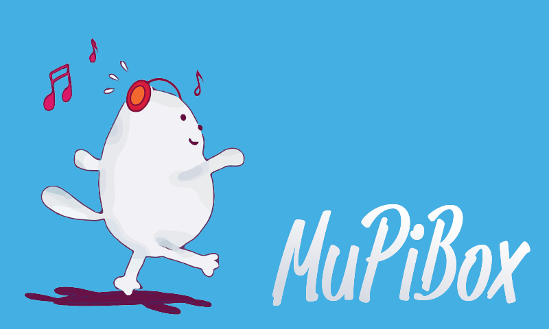

# MuPiBox

    

MuPiBox is an easy to use music player, controlled via touch display. You can use local music, Spotify and streams.
 
## Website & Support
For more information:
- visit https://mupibox.de 
- use our Discord-Channel https://discord.gg/4EjCgpCbbe
- see our Youtube-Channel: https://www.youtube.com/@mupibox

## Requirements
Please visit official website https://mupibox.de/anleitungen/installationsanleitung/was-wird-benoetigt/
## Known compatible hardware
Please visit official website https://mupibox.de/anleitungen/installationsanleitung/kompatible-hardware/
## How to install
Please visit official website  https://mupibox.de/anleitungen/installationsanleitung/einfache-installation/
## Spend a coffee via paypal to
- <a href="https://paypal.me/EGerhardt" target="_blank">nero</a>
- <a href="https://paypal.me/splittscheid" target="_blank">splitti</a>

## Based on
- DietPi (https://dietpi.com/)
- fbv by godspeed (https://github.com/godspeed1989/fbv)
- Initramfs Splash by DarkElevenAngel (https://gitlab.com/DarkElvenAngel/initramfs-splash)
- Sonos Kids Controller by Thyraz (https://github.com/Thyraz/Sonos-Kids-Controller)
- SpotifyController (https://github.com/amueller-tech/spotifycontroller)
- Librespot (https://github.com/librespot-org/librespot)
- mplayer-wrapper by derhuerst (https://github.com/derhuerst/mplayer-wrapper)
- pi-blaster by sarfata (https://github.com/sarfata/pi-blaster)
- google-tts by zlargon (https://github.com/zlargon/google-tts)
- Font Pan Pizza by Mark Lohner (https://www.marc-lohner.com/)
- Image by kirillslov (https://pixabay.com/de/vectors/katze-gehen-h%c3%b6ren-musik-kopfh%c3%b6rer-5775898/)
- Startup-Sound by Zeraora (https://freesound.org/people/Zeraora/sounds/572773/)
- Shutdown-Sound by Leszek_Szary (https://freesound.org/people/Leszek_Szary/sounds/133283/)
- WLED by Discord-User ronbal and ChatGPT
- jq (https://github.com/jqlang/jq/releases)
  
## Contributing
All contributions, e.g., reporting issues etc., are welcome.

If you want to contribute changes to the MuPiBox source code is easy thanks to GitHub codespaces that allow you to develop inside the browser without needing to set up a local development environment.
1. Fork this repository.
2. Start a codespace session.
3. The box UI and backend servers are located in `src`
    - Run `npm install` in the root folder the first time. To start the development server, copy the `config/templates/www.json` as `config.json` and the `monitor.json` files to the `src/backend-api/config` folder, and then run `npm run serve:backend-api` and `npm run serve:frontend-box`.
4. The Admin interface is located in `AdminInterface/www`.
    - Use `php -S 127.0.0.1:8000` to start a development server.
5. Create a git branch, commit and push your changes.
6. Create a pull request for your changes.

The Dockerfile in the root directory allows you to test your changes in a production setting (make sure to run `deploy.sh` first). Currently, only the box UI can be tested this way.
