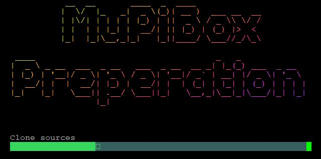

# MuPiBox Preparation Setup

## What is it for?
This scripts prepares and compiles software for the Autosetup.

## How to start?
Login with dietpi and start this command:

>cd; curl https://raw.githubusercontent.com/friebi/MuPiBox/develop/development_prepare/prepare-env.sh | bash
