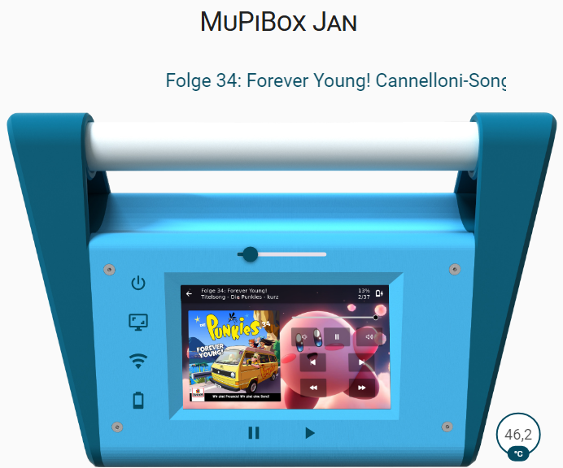

 [![Static Badge]
# Home Assistant example card
Just a quick Setup guide. Visit our discord channel (https://discord.gg/4EjCgpCbbe) for more informations.
 
## Setup
1. Copy the img folder to the www directory of your Home Assistant installation.
2. Open the card YAML and replace <YOUR_MQTT_BOXNAME> with the defined name of your MuPiBox in the MQTT settings.
3. Change the title of your card (look for <ANYTHING YOU WANT>).
4. Add the code to a manual card and enjoy!